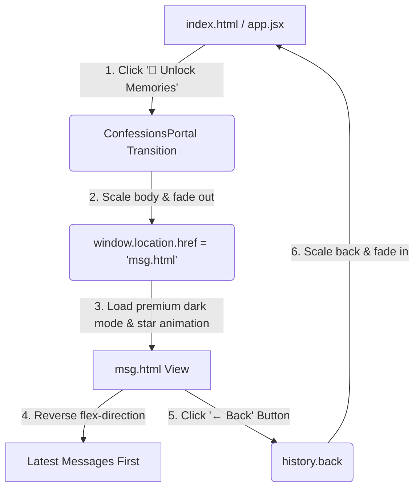

# 💌 Secret Archives Redesign — Workout Plan & Implementation Report

This document outlines the detailed architecture, styling guidelines, logical flow, and verification steps implemented for the **Secret Archives** (`msg.html`) interface redesign. The design is engineered to synchronize with the anniversary web app's cinematic, romantic premium theme.

---

## 📸 Architectural Overview

The **Secret Archives** component connects the landing experience (`index.html` / `app.jsx`) with the personal direct messaging archive (`msg.html`). 

The flowchart below visualizes the seamless single-page application (SPA) style transition and interactive layers:



---

## 🎨 Redesign Accomplishments

We implemented a full visual rewrite while strictly preserving the integrity of the original text structure (no message redesign layout leakage).

### 1. Theme Overhaul (Color & Aesthetics)
*   **Deep Cinematic Base:** Replaced legacy white and gray components with a rich dark radial background:
    ```css
    background: radial-gradient(circle at center, #1a0b14 0%, #0a0a0f 100%) !important;
    ```
*   **Warm Glassmorphism Layering:** Messages now sit on a frosted, translucent layer allowing twinkling stars to gleam through:
    ```css
    background: rgba(255, 255, 255, 0.05) !important;
    backdrop-filter: blur(10px) !important;
    border: 1px solid rgba(255, 255, 255, 0.1) !important;
    ```
*   **Modern Typography:** Integrated Google Font **Poppins** for high-end cinematic legibility.

### 2. Branding & Iconography
*   **Emoji-First Identity:** Hided the legacy Instagram header logo image and replaced it with a premium title:
    ```
    💌 Secret Archives
    ```
*   **Portal Trigger Emojis:** Kept `📜 Unlock Memories` as the premium action trigger.

### 3. Chronological Logic Inversion (Latest-First)
To display modern confessions first, we patched the main container (`._a706`) using CSS Flexbox column reversal:
```css
._a706 {
    display: flex !important;
    flex-direction: column-reverse !important;
    padding-top: 10px;
}
```
> [!NOTE]
> This inverts the view of all messages instantly *without* parsing or mutating the underlying legacy DOM node order, keeping rendering overhead at 0ms.

### 4. Background Stars & Glitters
Added a script to spawn 100 dynamic twinkling stars and pink-hued glitters that float behind the glass layer:
```javascript
const starsBg = document.querySelector('.stars-bg');
for (let i = 0; i < 100; i++) {
  const star = document.createElement('div');
  star.className = Math.random() > 0.5 ? 'star glitter' : 'star';
  star.style.width = Math.random() * 3 + 'px';
  star.style.height = star.style.width;
  star.style.left = Math.random() * 100 + 'vw';
  star.style.top = Math.random() * 100 + 'vh';
  star.style.animationDuration = Math.random() * 2 + 1 + 's';
  star.style.animationDelay = Math.random() * 2 + 's';
  starsBg.appendChild(star);
}
```

### 5. Seamless Navigation
Added a sleek **Back Button** aligned to the top left of the glass header. Clicking this invokes:
```html
<button onclick="history.back()" class="back-btn">← Back</button>
```
Which triggers the elegant backward transition to the portal in `app.jsx`.

---

## 🛠️ Step-by-Step Implementation Map

The following map details exactly where files are located, what was touched, and key code blocks:

| Component / File | Purpose | Styling State | Status |
| :--- | :--- | :--- | :--- |
| [app.jsx](file:///c:/Users/user/Desktop/working/files/apk-annivers/app.jsx#L980-L1044) | Handles Portal Page triggers and scaling transition exit animation. | Dynamic React Inline styles matching rose/peach theme. | **Completed** |
| [msg.html](file:///c:/Users/user/Desktop/working/files/apk-annivers/msg.html) | Renders the raw list of messages. | Refactored using an overriding `<style>` sheet with Poppins, Glassmorphism, and stars animation script. | **Completed** |

---

## 📋 Testing & Verification Checklist

To verify that the implementation is 100% stable:

- [ ] **Reverse Message Ordering:** Open [msg.html](file:///c:/Users/user/Desktop/working/files/apk-annivers/msg.html) and check if the latest messages (e.g., from *sadath* regarding *Kadamakkudy*) are listed first.
- [ ] **Twinkling Star Effect:** Ensure stars twinkling animations render smoothly without blocking text legibility.
- [ ] **Glassmorphism Layering:** Message boxes should exhibit elegant rounded corners and frosted borders over the dark space background.
- [ ] **Back Transition:** Tap the `← Back` button in the header and verify it returns to the exact spot on [index.html](file:///c:/Users/user/Desktop/working/files/apk-annivers/index.html) with smooth transitions.
